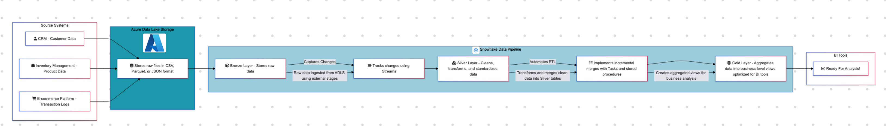

# Retail Data - Data Engineering Project

This project demonstrates the implementation of a modern Snowflake-based data pipeline to process customer, product, and transaction data for an e-commerce company. 
Using **Azure Data Lake Storage** and **Snowflake**, the pipeline consolidates, transforms, and aggregates raw data to support near real-time reporting and analytics.

---

## Table of Contents
1. [📂 Project Overview](#-project-overview)  
2. [📊 Data Pipeline Architecture](#-data-pipeline-architecture)  
3. [🗃️ Dataset Details](#-dataset-details)  
4. [🛠️ Data Pipeline Layers](#-data-pipeline-layers)  
5. [🧰 Tools & Technologies](#-tools--technologies)  
6. [🔮 Future Work](#-future-work)  

---

## 📂 Project Overview

This project addresses common e-commerce challenges:
- **Data Silos**: Consolidates data into Snowflake.
- **Processing Delays**: Reduces report generation time from 24 hours to near real-time.
- **Data Scalability**: Handles a 5x increase in data volume.

The pipeline uses **Azure Data Lake Storage** for raw data storage and **Snowflake** for centralized processing, enabling advanced analytics and self-service BI.

---

## 📊 Data Pipeline Architecture

Below is a visual representation of the **end-to-end Snowflake-based data pipeline** for this project:

  
*The horizontal diagram showcases data ingestion from source systems to the Azure Data Lake, processing through Snowflake layers (Bronze, Silver, Gold), and analysis stage.*

---

## 🗃️ Dataset Details

**Data Sources**:
1. **Customer Data**: Daily CSV exports from the Customer Relationship Management system.
2. **Product Catalog**: Hourly JSON updates from the inventory system.
3. **Transaction Logs**: Real-time Parquet files from the retail platform.

---

## 🛠️ Data Pipeline Layers

### **Bronze Layer**
- **Purpose**: Raw data storage.
- Exmaple **Associated SQL Files**: `02_create_stages.sql`, `06_create_streams.sql`, etc.

### **Silver Layer**
- **Purpose**: Cleaned and transformed data.
- Example **Associated SQL Files**: `07_customer_transformation.sql`, `08_product_transformation.sql`, etc.

### **Gold Layer**
- **Purpose**: Aggregated data marts and views.
- Example **Associated SQL Files**: `11_gold_layer_view_1.sql`, etc.

---

## 🧰 Tools & Technologies

- **Azure Data Lake Storage**: Centralized raw data storage.
- **Snowflake**:
  - **Stages**: Manage external data.
  - **Streams**: Track incremental changes.
  - **Tasks**: Automate workflows.
  - **Views**: Create business-level aggregates.

---

## 🔮 Future Work

- **Advanced Analytics**: Incorporate machine learning for personalized marketing.
- **Orchestration**: Use tools like Apache Airflow to automate workflows.
- **Data Quality**: Implement deeper validation logic.
